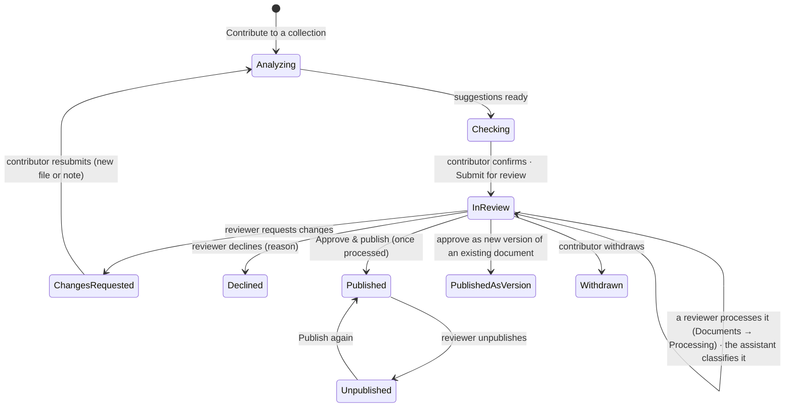

# Document lifecycle: contribute → process → review → publish

How a document becomes trusted knowledge in BoMesh. This extends the Knowledge Hub ([KNOWLEDGE_HUB.md](KNOWLEDGE_HUB.md)): the Hub is where people *use* published knowledge. This document owns the **per-document lifecycle** — contribute, process, review, publish, every state and label, the Review inspector's Classification fields, the drawer's steps and the workspace's topics. The Knowledge Studio as a whole (Manage IA, Documents with All · Processing · Review, Topics with All · Suggestions, the Process dialog, setup order, sources and their publishing policies, first sync at scale) is in [KNOWLEDGE_STUDIO.md](KNOWLEDGE_STUDIO.md).

## Principles

1. **Sharing is easy, publishing is deliberate.** Contributing takes a file, a destination (*Contribute to a collection* or *Upload to My files*) and a check of what the assistant read. Nothing anyone contributes reaches search, the Reader or the assistant until a reviewer approves it.
2. **Three steps, three places.** Contribute in **Knowledge** and track in **Your work → My contributions** (contributors). Set up, review, publish and process in **Manage › Knowledge Studio** (collection owners, source admins and workspace admins). Operate indexing in the **Platform console → Indexing** (platform admins). No screen mixes two of these jobs.
3. **Publishing and processing are separate.** Publication decides who may see a document; processing (read → classify → index) decides whether search and the assistant can use it. Uploading processes nothing; processing happens only in an explicit run someone starts. A document is searchable only when it is published **and** processed.
4. **The assistant does the busywork; people decide.** When a document is contributed it suggests topics (existing ones, or a proposed new one) with the evidence for each, the collection and a summary, and flags likely duplicates, new versions, personal data and unsearchable formats. The contributor confirms or edits before submitting; reviewers check and publish, and their topic changes are recorded as corrections that become suggestions. Only workspace admins change the topics.
5. **Plain words.** People see *In review, Changes requested, Declined, Approve & publish, Published, Unpublished*, and processing states *Not processed, Processing, Processed, Failed, Changed at the source, Not supported*. Terms like "embedding" appear only in the platform console.
6. **Access never widens by accident.** A submission is visible only to its contributor and the reviewers of its target collection. Approving publishes into that collection, so its access rules decide who can read it, and the review screen states who that will be. Platform admins see job metadata, never titles or content.

## Lifecycle

```mermaid
stateDiagram-v2
  [*] --> Analyzing: Contribute to a collection
  Analyzing --> Checking: suggestions ready
  Checking --> InReview: contributor confirms · Submit for review
  InReview --> InReview: a reviewer processes it (Documents → Processing) · the assistant classifies it
  InReview --> ChangesRequested: reviewer requests changes
  ChangesRequested --> Analyzing: contributor resubmits (new file or note)
  InReview --> Declined: reviewer declines (reason)
  InReview --> Published: Approve & publish (once processed)
  InReview --> PublishedAsVersion: approve as new version of an existing document
  Published --> Unpublished: reviewer unpublishes
  Unpublished --> Published: Publish again
  InReview --> Withdrawn: contributor withdraws
```

| Label people see | `stage` | Who sees it | Next step |
| --- | --- | --- | --- |
| Analyzing → Check the details (in the dialog, before submitting) | — | Contributor | Confirm or edit, then Submit for review |
| In review | `review` | Contributor, collection reviewers | A reviewer processes it (a new document), then decides |
| Changes requested | `changes` | Contributor, reviewers | Contributor revises and resubmits |
| Declined | `rejected` | Contributor, reviewers | Contributor reads the reason and removes it (kept for the retention period) |
| Published | `published` | Everyone who can read the collection (searchable once processed) | Use it, or submit a new version |
| Published as new version | `versioned` (target `submission.versionOf`) | Contributor | The original now shows the new version |
| Unpublished | `unpublished` | Reviewers | Publish again (Unpublish is immediate with Undo) |

Private files (**My files**, *Upload*) skip review: only their owner can use them. *Share as knowledge…* moves a private file into review for a collection without copying it.

Synced files follow their **source's publishing policy**: *Publish automatically* (trusted systems such as the regulations drive or the LMS; every sync publishes what it found), *Review only what's uncertain* (publishes clean files and holds only files flagged for personal data, a likely duplicate or a likely new version; the default above 1,000 files) or *Review everything* (untrusted or small feeds such as the university website; every new or changed file is a submission, and a changed published file becomes a *new-version* submission while the published copy keeps answering). Policies, their defaults and batches at scale: [KNOWLEDGE_STUDIO.md](KNOWLEDGE_STUDIO.md#configuring-a-source).

## Publication and processing

Every document has two independent states, as in the backend's Item (`backend/docs_design/item_model.md`):

| State | Backend field | Values people see | Changed by |
| --- | --- | --- | --- |
| Publication | `publicationState` (with the review stage) | In review · Changes requested · Published · Unpublished · Declined | Review decisions, a source's publishing policy, Publish / Unpublish |
| Processing | `indexingState` | Not processed · Processing · Processed · Failed · Changed at the source · Not supported | Explicit ingestion runs only |

Neither implies the other: a published document can be Not processed (people open it from its collection; search and the assistant can't use it), and a processed one can be Unpublished. **Searchable = published and processed.** A new document's submission is processed **before** it's reviewed (in review, Not processed until a reviewer processes it); a new version's is processed after it's approved. Document status chips (`status('doc')`) use the processing words; the lifecycle chip shows *Not processed*, *Processing*, *Processing failed* or *Changed at the source* for a published document that isn't searchable yet.

### Processing states

| State (`indexingState`) | Meaning | Fix (in Documents) |
| --- | --- | --- |
| Not processed (`PENDING`) | Not read, classified or indexed yet; search and the assistant can't use it | *Process* |
| Processing (`RUNNING`) | Being read, classified against the topics and indexed | — (the processing strip offers Stop) |
| Processed (`SUCCEEDED`) | Read, classified and indexed; searchable once published | *Publish* if unpublished |
| Failed (`FAILED`) | Couldn't be read or indexed; listed in Processing | *Process again*, Replace file (uploads), Open source (password-protected synced files) |
| Changed at the source (`OUTDATED`) | Changed at the source since it was processed; answers use the previous version; listed in Processing | *Process the update* (re-reads from the source; never a file picker) |
| Not supported (`UNSUPPORTED`) | Images and archives; download only | — |

`PROCESSING` and `processingOf()` in `core/lifecycle.js` hold this vocabulary; `canProcess()` allows a run on published or unpublished documents and on new documents' submissions (`isCandidate`) that aren't running and aren't images or archives. `processingQueue()` is what Documents → Processing lists; `readyToReview()` what Review lists (a new document once processed, or in a format that can't be; a new version).

### What starts processing

Processing happens only through an explicit **ingestion run** (`X.processRun` in `features/documents.js`):

- **The Process dialog** over a selection in Documents → Processing or All (a page, or *Select all matching*): which topics the AI may suggest (*All topics* | *Selected*), whether the vision model reads text in images (off by default) and optional context for the AI, then *Process N documents* for checked rows, or *Process the matching documents* for *Select all matching* (a filter: no number, no time estimate). It never publishes. [Details](KNOWLEDGE_STUDIO.md#processing-a-selection).
- **Processing a submission before review.** A reviewer processes a new document's submission in Documents → Processing (its row's *Process*, or a selection). Its CLASSIFYING step matches the target collection's rules and topics against its title, note and text; the topics it chooses and a summary replace the submission's suggestions (no confidence), and it moves to Review ("… is processed and ready for review · Review"). Approving never processes: the processed document keeps its index; an approved new version is Not processed and waits in Processing.
- **A row's fix**: *Process*, *Process again*, *Process the update*, from Processing, All or the document drawer.
- **A source's sync**: it processes the clean files it publishes under its policy, but never a file it holds for review as a submission: a synced new document waits in Documents → Processing like a member's contribution and moves to Review once processed (ApproveContribution needs a processed NEW_DOCUMENT candidate whatever its origin). The preview's first-sync batches (*Held back by a sync*) are counted, not listed, and publish as one decision.

Stopping a run (`X.stopProcessRun`) keeps what's done processed and returns the rest to Not processed.

| Origin | Classified (at processing) | Published |
| --- | --- | --- |
| Member contribution | Suggested on submit and confirmed or edited by the contributor; when a reviewer processes it, the assistant classifies it against the target collection (the contributor's confirmed topics stay) and the reviewer checks that in the Review inspector | Documents → Processing, then Review |
| Source sync, *Review everything* | The assistant's suggestions on submit; once a reviewer processes it, what processing chose; the reviewer confirms | Documents → Processing, then Review |
| Source sync, *Review only what's uncertain* | The pipeline applies its matches; a file with a risk flag is a submission like a contribution | Flagged files in Review (*Held back by a sync*, batches by reason, at first-sync scale); the rest by the policy |
| Source sync, *Publish automatically* | The assistant picks the topics among the candidates and applies them (marked *Assistant*); a document it gives no topic is listed in Topics → Suggestions. No confidence score, no threshold | By the policy: "Not needed: {source} publishes automatically" |
| Editor upload into a collection | The topics its editor gives; otherwise "No topic yet" with *Add topic* | By the editor: "Not needed: added by an editor of the collection" |

**Who sees it after publishing is the collection's audience.** The Collection field's helper says who, e.g. "Everyone in Finx Workspace will see it" for a collection whose general access is Everyone. Making a document public to the workspace means publishing it into such a collection; there is no separate visibility flag.

**Review → Classification.** The suggestions are the Review inspector's form — Document name → Collection (who will see it) → Topics → Summary — under one provenance line. For a processed new document they are what the assistant chose while processing it: ✦ "The assistant filled in the fields below. Check them before publishing."; "Confirmed by the contributor." when the contributor confirmed details and it wasn't processed; a new version reads "Suggested from its name and note. A new version is processed after it's published.", a format that can't be processed "This file type can't be processed: suggested from its name and note." Each field has one status tag on its label row: *Suggestion* for the assistant's value (with its confidence when there is one, e.g. "Suggestion · 82%"), *Edited* once the reviewer changed it. Topic chips are neutral, with the topic's icon (a tag by default) in its domain's colour: a chosen one declines with ×, a declined suggestion (dashed) comes back with +, *+ Add topic* adds any existing topic (listed under its domain; the web picker searches topic and domain names); an accepted proposal says *New*. When the contributor confirmed the details, Collection shows *Chosen by the contributor* instead of a tag; a collection is needed to publish, and while none is chosen its helper says "Choose a collection to publish to", and each confirmed topic's evidence starts "confirmed by the contributor". Under the topic chips, each topic says why it matched (`topicEvidence`): rule: documents in "Chargebacks" · matched "chargeback", "dispute" (keywords and synonyms alike, up to 3 words) · like example "{document}" · the title names it · like "{similar document}" · common in this collection. A proposed new topic adds a quiet note ("You can publish without it.") with *Decide in Topics → Suggestions* for admins, "A workspace admin decides." for reviewers. When the reviewer changes the suggested topics, *Use my change to improve classification* (on by default) appears; approving then records a **correction** (`recordCorrection`) that admins see in Topics → Suggestions, and marks the topics *Set by a person*.

**Document drawer → steps.** Under the lifecycle chip and its one note (the error, or the reviewer's message), a vertical stepper shows **Received · Processed · Reviewed · Published · Searchable**, each done, current, issue, skipped or to do, with one line: who and when ("Contributed by …", "Synced from …", "Uploaded by …"); for a submission "Not processed yet: process it so the assistant classifies it for review" (with *Process*) or "Classified for review · {topics}", for a document "Not processed yet: search and the assistant can't use it", the error, or "Changed at the source · answers use the previous version"; "Once it's processed" (a submission waiting), "Approved by …", "Changes requested by …" or "Not needed: {source} publishes automatically"; "Searchable · Everyone in …". Publish and Process buttons sit on the step that needs them; Searchable needs both. History is a collapsed disclosure; Details follow.

## Roles and permissions

| Capability | Contributor (`knowledge.contribute`) | Reviewer (Owner of the collection) | Workspace admin (`tenant.manage`, owns every collection) | Platform admin (`platform.*`) |
| --- | --- | --- | --- | --- |
| Read published knowledge | Collections they can read, minus folders with their own access that don't name them | Same | All | Only through workspace membership |
| Contribute, track, revise, withdraw | ✓ (to collections they can read that accept contributions) | ✓ | ✓ | — |
| See a submission | Their own | Submissions to collections they own | All | Never (job metadata only) |
| Open Documents (All · Processing · Review) | — | Collections they own | All | — |
| Approve & publish, request changes, decline | — | Collections they own | All | — |
| Choose the collection on approval | — | Among collections they own | Any | — |
| Process, process again, unpublish, retry, replace, archive | — | Collections they own | All | Retry jobs (no content) |
| Collections: contents (folders, moving documents), sources (Knowledge Studio → Collections) | — | Collections they own or edit | All | — |
| Collections: access, a folder's own access, settings | — | Collections they own | All | — |
| Topics: import, export, edit topics (names, keywords, synonyms, examples, guidance, rules); accept, merge or dismiss proposed topics and correction keywords | — | — (sees Suggestions, proposals read-only; the inspector shows "A workspace admin decides"; no Topics view) | ✓ (Topics → All and Suggestions) | — |
| Sources, accounts, publishing policy (Knowledge Studio → Sources; `source.manage`) | — | — | ✓ | — |
| Indexing policies, pause/resume a workspace's indexing | — | — | — | ✓ |

Finx: engineers contribute; Lê Thu Hà (Lead) reviews the Payments Platform and Engineering Handbook collections; Phạm Quốc Bảo (Analyst) reviews Data Platform & Analytics; Võ Thị Lan (Admin) reviews everything and owns the topics. Northwind: members contribute; collection owners and the admin review.

## Classification

| Concept | Answers | Example | Who sets it |
| --- | --- | --- | --- |
| Type | What kind of file is it? | PDF, Word, Presentation, Spreadsheet | Derived from the file itself (PDF, Word, Presentation, Spreadsheet, Markdown, HTML, Plain text, Data, Image, Audio, Video, Archive, Other). Nobody sets or edits it and the assistant never suggests it; meaning lives in topics |
| Topic | What is it about? | Reliability & on-call, Metrics & definitions | Chosen from the workspace's topics. The assistant may *propose* a new topic; workspace admins decide it in Topics → Suggestions. Publishing never waits for that decision |
| Collection | Where does it live, and who can read it? | Payments Platform | The contributor chooses it in *Check the details* (pre-selected when contributing from a collection page, into the folder open there); the reviewer confirms |
| Folder | Where in the collection is it kept? | Runbooks › Gateway & cards | Editors, in the collection's Contents (move documents, make folders). A folder can have its own access, which then decides who reads it instead of the collection |

Classification runs **once per document, at processing time**, between reading and indexing (`document_profile.md`); a document that isn't processed isn't classified by the pipeline (a submission carries the suggestions made on submit until a reviewer processes it, which replaces them with what processing chose). Its summary goes into `contextual_rag.md` as a `<document_profile>` block before each passage; topics live only in the index's metadata, so re-classifying never needs re-indexing.

### Topics

The **topics** are the workspace's domain → topic tree — the same topics readers browse as pills — and the signals that recognise each. One set per workspace; only workspace admins see the view (`/studio?tab=topics&view=topics`, selection in `?node=`; older `tab=taxonomy|master` and `mode=rules` addresses are rewritten). Each domain and topic is known by its **name**; its ID is internal (generated when it's added, kept in `?node=` and API calls) and never shown or typed — no codes anywhere in the view, its dialogs or Suggestions. A topic adds the classification signals below.

- **Job:** the topic tree documents are filed under, and the words that recognise each topic.
- **Layout:** the header holds ⋯ (*Show the classification prompt* · Export topics · Download template) and Import (secondary); with no topics yet the header is empty and the empty state carries Import (primary) and New domain. A one-line summary ("n domains · n topics · n keywords", keywords counting synonyms; "Last imported … by …" (the last ImportTopics in the audit log) only once an import exists) whose "n topics without keywords" is a toggle (`?show=bare`: narrows the tree to those topics and opens the first); a **tree** (topics without keywords or synonyms carry a hollow warning ring; "Search topics" over names, keywords and synonyms, collapsible domains with counts (closed by default except the selection's; search opens matches), archived last; keyboard navigable) beside the **detail** of the selected node. Without `?node=`, the first domain opens. Phones show the tree first and open a topic full screen with Back.
- **Topic detail:** header — the **name is click-to-edit** (a quiet pencil beside it; Enter or clicking away saves, Escape cancels, a name the domain already has keeps the field open with the error), a topic's **domain** under it is a quiet menu button (*Move to domain*: every active domain, the current one checked), and **Archive** is one icon; each applies at once with Undo, with no ⋯ menu, form or save bar — then **Keywords** ("Words in a title or text that mean a document belongs here, including other names people use for it."; one chip list — keywords and synonyms count the same, so existing synonyms show as ordinary chips and stay synonyms, and new words are added as keywords) · **Description** ("People see it when they choose a topic; the assistant reads it when it classifies.") · **Fine-tune classification (optional)**, collapsed, its closed summary e.g. *Guidance · 2 examples · 1 rule* or *Not set*, holding **Guidance** ("When the assistant should use this topic, and what belongs elsewhere."), **Examples** ("Two or three documents that clearly belong here. The assistant compares new documents with them.") and **Always file here** ("Documents in a collection or from a source you pick always get this topic. The assistant isn't asked."; the rules) · distribution over collections, and a **Test classification** box. Adding a domain or topic asks only its name (and a topic's domain). The other fields go through one save bar (Save · Discard); each topic keeps its own unsaved draft (marked with a dot in the tree), an untouched draft follows imports and Undo, and a rename or move keeps a draft's other unsaved edits.
- **Archive** applies at once with Undo; a topic still in use isn't disabled — a message says what to retag or move first.
- **No threshold:** classification has no confidence score and no auto-tag setting. The assistant picks every topic a document is substantially about among the candidates — several when it covers several subjects, across domains, never for a passing mention; a document it gives none is published without a topic and listed in Topics → Suggestions.
- **Show the classification prompt** (⋯): a drawer with the compiled `document_profile.md` prompt processing sends, in its two parts — *Shared by every document* (instructions, run note, the taxonomy by domain with labels T1…Tn; the provider caches it) and *Each document* (keyword matches, title, excerpt) — the rules checked first, and the `<document_profile>` block; Copy prompt and token estimates for both parts. Topic IDs never appear: the model answers with labels and names.
- **Suggestions** are not in the tree: topics the assistant proposes ("Accepting adds the topic and tags the documents that mention it."; Accept · Rename · Change domain · Merge into, which adds the proposal's name as a **synonym** of the target · Dismiss, with Undo), keywords from reviewers' corrections, topics to confirm and documents without a topic are in Topics → Suggestions ([details](KNOWLEDGE_STUDIO.md#suggestions)).
- **Re-classification:** saving, importing, or adding a keyword or example re-classifies every open submission's suggestions and re-checks the processed documents the pipeline tagged (people's choices stay); only those whose result changes move. Toast: "… n documents re-checked, n changed topic. No re-indexing needed.", with Undo.
- **Import** (one dialog, two steps): *Import topics* — a drop zone (CSV or Excel; columns `domain, topic, description, keywords, synonyms, guidance, name`; only `domain` required; a row without `topic` describes its domain; missing columns are neither compared nor changed; keywords and synonyms split on `, ; |` and line breaks), a sample, Download template (the same columns without `name`), and **Add and update** (default) or **Replace** (also archives active topics and domains no row matched; ones in use are kept) → *Check the changes*: skipped rows with row number, *Domain › Topic* and reason (no domain; the same topic twice in one domain; a name more than one active topic or domain shares; a `name` that is unknown, archived or of the other kind; keywords, synonyms or guidance on a domain row; too long), New, Updated (what changed), Archived, Kept, each as *Domain › Topic*, and effects (submissions classified again, published documents re-checked; proposals covered). Rows **match by name** (case- and space-insensitive): a domain among the active domains — created when none matches, also when only its topics' rows name it —, a topic among its domain's active topics, else created with a generated ID. **Export** writes the same columns with `name` last: the topic's resource name (`workspaces/{ws}/topics/{id}`), so a re-imported export can rename a topic or move it to another domain; nobody needs to fill it. Applying records the import and an audit event and toasts with Undo. Rules and examples live only in Studio.

### How classification works

Prototype rules, deterministic, in `core/lifecycle.js` (`topicMatches`). Keywords are one signal among several:

| Signal | Effect |
| --- | --- |
| Keywords and synonyms | Matched against the title and note; synonyms count the same as keywords. Distinctive name words count too; words shared by many topics count only with other evidence |
| Rules | Documents in a collection (its whole subtree, folders included) or documents from a connected source (uploads aren't a source, so no source rule matches them). A matching rule settles the topics: the document gets exactly the matching rules' topics and the model isn't asked |
| Examples | Example documents of the topic; a weaker signal when a new title looks like one |
| Similar documents and the collection | Similar published documents contribute their topics; the target collection's usual topics too; with nothing distinctive, the collection's dominant topic at low confidence |
| Guidance | Free text the assistant reads; not used by the matcher |

- Each suggested topic keeps its evidence (rule, keywords, synonyms, example, title, similar document, common in this collection), shown as readable phrases to the contributor and the reviewer. The Test classification box runs the same rules with unsaved changes (a title, plus an optional collection and source to check rules) and lists each matched topic labelled *Rule* or *Assistant* — no scores — saying whether the topic comes 1st, 2nd, 3rd or not at all.
- Documents from auto-publish sources are classified the same way when their sync processes them: the topics the assistant picks are applied as *assistant-applied* (labelled *Assistant*); people's topics are never replaced. A document it gives no topic is listed in Topics → Suggestions → *Without a topic*.
- Proposed topics come from recognisable themes (Open banking, AI governance, Internships, Sustainability, Hybrid work) that have no topic yet. A proposal collects every submission that raised it; admins decide it in Topics → Suggestions.
- Flags (risks render as labelled chips, the rest as small icons with tips):
  - *Possible duplicate*: ≥ 55 % title similarity to a published document.
  - *New version*: the contributor submitted it as one.
  - *Personal data*: CVs, salary documents, customer exports, card numbers, ID documents.
  - *File type*: images and archives can't be searched.

## Journeys

### Contributor
1. **Share.** Knowledge → *Contribute* (or ⌘K, a collection page, My contributions or the Studio's Documents *Add documents*) → *Contribute to a collection* is preselected (or *Upload to My files* to keep it private; that and *Submit a new version* stay one step) → drop files → Continue.
2. **Analyzing.** A visible step: "Reading the file and matching it against {workspace}'s topics…".
3. **Check the details.** Per file: an editable title (it becomes the file name, extension kept), topics as removable chips with their evidence plus *Add topic…*, the collection with "{who} will see it once published", a suggested summary ("{title}. Covers A, B and C."), personal-data and possible-duplicate warnings, and a note for reviewers. Back keeps your edits. *Submit for review* stores what you confirmed with the submission. Toast: *Submitted for review · Open* → `/contributions?open=id` (a reviewer submitting to a collection they review gets *Process*, or *Review now* for a new version).
4. **Track.** Your work → **My contributions** (`/contributions`; header *Contribute*): every submission with its lifecycle label and its latest event in words ("Lê Thu Hà asked for changes · 2 days ago"), *Revise* when changes were requested. Filters: All · Needs your action · In review · Published · Declined (counts only where there are items). A row (or `?open=id`) opens the drawer: a stepper **Submitted → Analyzed → In review → Approved → Published** (no status chip), the reviewer's message as an alert, *What you confirmed*, and a collapsed History. An approved contribution says *Approved · not processed yet*, *being processed* or *processing failed*; its Published step reads "Published · waiting to be processed" until it is. A collapsed Your work group shows a dot when changes are requested; Home's *Needs your attention* shows it too.
5. **Revise.** Inbox → *Changes requested* → the contribution drawer shows the reviewer's message in its alert → attach a revised file and say what changed → *Resubmit*. It goes back to the reviewer, re-analysed. A declined contribution shows the reason the same way, with *Withdraw*.
6. **See it published.** Inbox → *Published* → open it in the Reader. Later, for uploads, ⋯ → *Submit a new version…* sends an update to review while the current version stays published.

### Reviewer (collection owner)
1. **Notice.** The sidebar badge on Manage › Knowledge Studio (what keeps documents from people: submissions ready for review or waiting to be processed, batches held back by a sync, documents that failed or changed at the source), Inbox items ("n submissions are waiting to be processed · Process", "n documents are waiting for your review · Review") and *Needs your attention* on Home say how many documents wait.
2. **Process.** Knowledge Studio → Documents → **Processing** lists submissions first (*Submission · contributor → collection*, "Goes to Review once it's processed"), then what isn't processed, failed or changed at the source. Select them → **Process** → the Process dialog ("Submissions go to Review once they're processed."), or a row's *Process*. The assistant classifies each against the target collection; the toast offers **Review**. A submission that can't be processed (*Process again* fails) still gets an answer from its ⋯: *Request changes…* · *Decline…*.
3. **Review.** Knowledge Studio → Documents → **Review** is a workbench (list · document · inspector); *Held back by a sync* batches come first, then *Submissions* (processed new documents, formats that can't be processed, new versions):
   - The whole document, scrolling in its pane (*Open full preview* for zoom and find).
   - The contributor's note.
   - The form (✦ "The assistant filled in the fields below. Check them before publishing."): document name, collection with who will see it, topics with the evidence for each ("matched “chargeback”, “dispute”"), summary; a quiet note when it suggests a new topic ("You can publish without it"); labelled risk chips (*Personal data*, *Possible duplicate* with Compare) and other flags (publish as a new version). Changing the topics shows *Use my change to improve classification* (on by default), which records a correction on approval.
   - Decide: *Approve & publish* (full width; it publishes only — a processed document is searchable at once, a new version waits in Processing), *Request changes* (message required, quick replies), or *Decline* (reason required) — two equal outline buttons under it. The next item opens automatically. Undo is always offered. Keyboard: J/K move, Enter opens, **A** approves & publishes, **R** requests changes.
   - Selecting several swaps the decision bar for the floating bulk bar; bulk approve accepts the suggestions, skips anything flagged as personal data and says so. First-sync batches are one decision each: [KNOWLEDGE_STUDIO.md](KNOWLEDGE_STUDIO.md#3-what-people-decide-minutes-not-months).
   - Empty: "Nothing to review", with *Go to Processing* while submissions wait to be processed.
4. **Fix what stopped.** Documents → **Processing** also lists what couldn't be processed or changed at the source (state pills *Failed* · *Changed at the source*); each row shows its fix — *Process again*, Replace file (uploads), *Process the update* (synced documents changed at the source), or Open source (password-protected synced files); select several to process them together. Every row opens the document drawer (chip, one note with the reason and fix, steps, History). Unpublish is immediate with Undo.
5. **Process what's waiting.** Documents → Processing → *Not processed* → select (or *Select all matching*) → **Process** → the dialog → the processing strip; [the 1,000-document flow](KNOWLEDGE_STUDIO.md#the-1000-document-flow).
6. **Quality.** Documents → All → **Quality** (`quality=reverify|details|duplicates`): Re-verification due (expired or never verified; Verify) · Missing details (owner, summary; Edit details) · Possible duplicates (Compare; merging keeps one document, moves every reference to it — saved, recent, space materials, shortcuts, conversation references — and archives the duplicate; Undo restores the duplicate only, the references stay on the kept document). Published documents without a topic are in Topics → **Suggestions**.

### Workspace admin
Everything a reviewer does, across all collections, plus:
- **Import topics** (Northwind journey *Import topics and reclassify submissions*). Topics → All → *Import* (header) → drop the spreadsheet (or *Try it with* the sample) → *Add and update* → *Check the changes*: skipped rows with reasons, new and updated topics, "n submissions in review will be classified again" → *Import n changes* → the toast offers Undo; the Review inspector now shows the new matches with their evidence.
- **Decide suggestions** in Topics → Suggestions (accept, rename, change domain, merge or dismiss proposals); in Topics edit a topic's description, keywords, synonyms, rules, examples and guidance and test it before saving; export the topics to edit them in a spreadsheet.
- **Teach classification from reviewers' corrections** (Finx journey of that name). Topics → Suggestions → *Keywords from reviewers' corrections*: "Reviewers moved 3 documents to Reconciliation", *Misled by "napas"* → press the "đối soát" chip → toast "… documents re-checked, 1 document changed topic. No re-indexing needed." with Undo; open the classification prompt to see what processing sends.
- **Choose what to process** (journeys *Choose which of 1,000 digitised records to process*, UTE, and *Choose which of 1,200 uploaded documents to process*, Finx): [KNOWLEDGE_STUDIO.md](KNOWLEDGE_STUDIO.md#the-1000-document-flow).
- **Set up and run sources:** collections → topics → sources in setup order (journey *Finish setting up knowledge*), publishing policies and the first sync at scale: [KNOWLEDGE_STUDIO.md](KNOWLEDGE_STUDIO.md).
- **Overview:** Knowledge health's metrics (Processing · Review · Topic suggestions · Quality · Verified) each link to their view; Needs attention covers sources, accounts, access and requests ([KNOWLEDGE_STUDIO.md](KNOWLEDGE_STUDIO.md#overview--knowledge-health)).

### Platform admin
Platform console → **Indexing**:
- Sidebar sub-rows **By workspace** (per-workspace queue, failure rate and status; a paused row's Resume, and a row ⋯ with only what applies — Retry failed jobs when a retry can succeed, Show jobs, Pause indexing; the workspace drawer adds throughput, median time and error classes; errors grouped by class) · **Jobs** (id, workspace, file type, size, step, error class: no titles, no content; a job drawer with Retry job) · **Policies** (available before any job has run).
- Platform policies: allowed types, max size, OCR for scanned PDFs, spreadsheet parsing, retention of declined submissions. "Uploads need review" is locked on.

## Decisions and why

| Decision | Why |
| --- | --- |
| One **Knowledge Studio** replaces Manage › Documents (and before it Knowledge health and the per-collection inventory); it holds Documents, Collections, Topics and Sources ([why](KNOWLEDGE_STUDIO.md#decisions-and-why)) | Contributions, synced files and uploads land in one place, and reviewers and admins have one place to run them |
| Sections named after resources: **Documents** (All · Processing · Review) and **Topics** (All · Suggestions) ([why](KNOWLEDGE_STUDIO.md#decisions-and-why)) | Names follow domain resources; a workflow page with modes and a stage bar mixed publication and processing in one sequence |
| Publication and processing are two independent states, each with its own column; no stage bar | They change for different reasons and by different people; one bar implied an order that doesn't exist (a published document can be Not processed) |
| Processing is explicit: nothing is processed on upload | Matches the backend (`item_model.md`); with 1,000+ documents an admin chooses what to process, sees the estimate and can stop |
| A submission is processed before it's reviewed; approval never processes (`item_model.md` 4.7) | The reviewer decides on the assistant's classification of the file, not a guess from its title, and nothing is classified twice. The reviewer still chooses what to process — no automatic run on submit — so a file that will be declined costs nothing unless someone processes it |
| Topics = the topics people browse, known by their names, each with several classification signals; no separate category concept and no user-facing codes | One concept, one word: the classification target is exactly what readers see as Browse pills, so a document is never filed under something nobody can browse. IDs are technical and give people no insight, so they stay internal: the spreadsheet matches names (an export's `name` column carries the resource name for renames and moves); keywords, synonyms, rules and examples make classification explainable and testable |
| Reviewers' topic changes are recorded as corrections and suggested to admins, never applied automatically | The people closest to the documents improve the rules; admins stay in charge of what the rules say |
| The contributor checks the details before submitting | The person who knows the file confirms topics, collection and summary; reviewers check rather than fill in, and see what was confirmed |
| Audience is the collection's access ("Everyone in {workspace}"), not a new public flag | Access already lives on the collection. A second visibility switch could contradict it; the decision bar states the audience before publishing |
| Documents from auto-publish sources are classified by the assistant, without a threshold | They never pass a reviewer, yet must be findable by topic. The assistant picks topics among the candidates and they're applied as *Assistant* (people's topics stay); there's no confidence score to tune. What it gives no topic waits in Topics → Suggestions |
| Contributions are **My contributions** under Your work, not a Knowledge section | Tracking what you submitted is your work, like Recent and Projects; Saved and My files keep what you saved and own |
| The collection is chosen in *Check the details*, with the assistant's suggestion pre-filled and who will see it | Contributors needn't know the workspace structure, but they see the audience before submitting; reviewers confirm the placement |
| Approval publishes (no separate "Publish" step after approval) | Reviewers think "is this right and should people see it?", which is one decision. Processing comes before it, in Processing |
| New versions go through review while the current version stays published | Knowledge never disappears during an update; the reviewer approves the change, not the whole document again |
| Topic proposals collect evidence across submissions, need a workspace admin, and never hold publishing back | Prevents topic sprawl; admins see why a topic is wanted before creating it (Topics → Suggestions), and reviewers aren't blocked by a topics decision |
| Personal-data and duplicate flags never block, but bulk approve skips flagged items | Reviewers stay in control; bulk speed never publishes a transcript by accident |
| Platform admins see job metadata only | Operating infrastructure doesn't require reading confidential documents |

## Backend alignment and open decisions

- **Matches `backend/docs_design`:**
  - The Document is created before processing ("adding is not processing").
  - Nothing is processed on upload; ingestion runs are explicit (a selection, a row's fix, a source's sync), and approval never starts ingestion: a reviewer processes a NEW_DOCUMENT candidate first (`CreateIngestionRun` with the candidate in `items[]`; its CLASSIFYING step replaces the contribution's suggested topics and summary), and ApproveContribution answers `CANDIDATE_NOT_PROCESSED` until it is (unsupported formats pass). A NEW_REVISION is processed by a run after approval.
  - `publicationState` and `indexingState` (PENDING / RUNNING / SUCCEEDED / FAILED / OUTDATED / UNSUPPORTED) are the Publication and Processing state columns; *OUTDATED* is Changed at the source in Processing.
  - Who can read a published document is the collection's role assignments (Everyone = `role_assignments.all_members`).
- **Needs backend design:**
  - A review stage on Items (`review | changes | rejected | published | unpublished`) and its events, which are distinct from `status`.
  - Submission visibility (contributor + collection owners) before publication.
  - Stored assistant suggestions, with per-topic evidence (`why`) on ContributionSuggestions.topics.
  - Topic proposals.
  - Topic `keywords[]` (classification hints) on the `topics` resource and table.
  - Topics import and export: a custom method (e.g. `topics:import`, `mode MERGE | REPLACE`) returning an Operation with a validate-only check step; import history (who, when, file, counts) as audit events or a small import record.
  - Classification output beyond topics, topics in index metadata (re-check, not re-index) and classification corrections: [KNOWLEDGE_STUDIO.md](KNOWLEDGE_STUDIO.md#backend-alignment-and-open-decisions). No classification threshold and no processing-state counts (both decided). Ingestion runs over a selection or filter with a classification context, Stop, processing a contribution's candidate before review and approval without ingestion are in the contract.
  - Auto-classification of documents from auto-publish sources at processing (assistant-applied topics, flagged as assistant-applied).
  - Topic `synonyms[]`, `rules[]`, `examples[]` and `guidance` ([KNOWLEDGE_STUDIO.md](KNOWLEDGE_STUDIO.md#backend-alignment-and-open-decisions)).
  - Contributor-confirmed metadata on CreateContribution (collection, topics, summary), returned to reviewers as confirmed.
  - Re-classification of open contributions when the topics change (refresh `contribution_topics` suggestions).
  - Per-source publishing policy with three values, including `REVIEW_EXCEPTIONS` ([KNOWLEDGE_STUDIO.md](KNOWLEDGE_STUDIO.md#backend-alignment-and-open-decisions)).
  - A platform indexing API that exposes job metadata without content.
