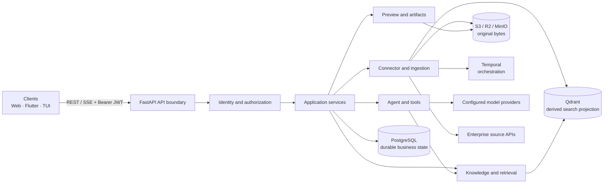
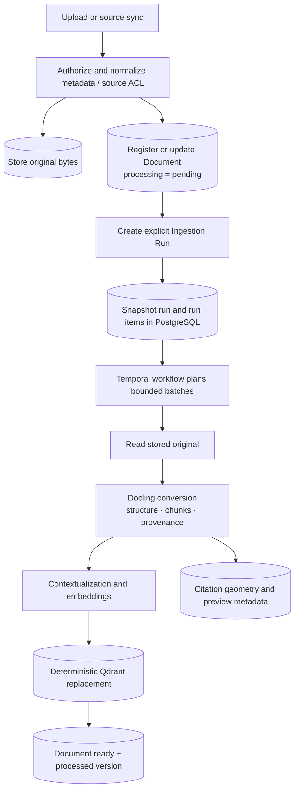
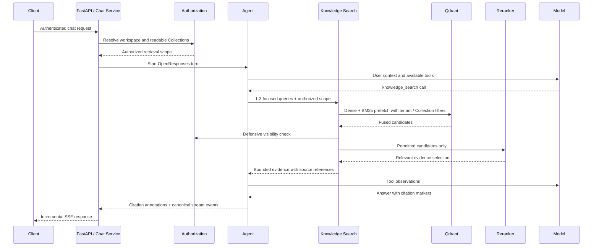

# BoMesh Architecture Overview

**Document type:** Technical architecture overview  
**Scope:** Current implemented repository architecture  
**Status:** Architecture baseline

> This document summarizes the system architecture. The detailed repository design contracts remain the authority for implementation changes.

## 1. Executive overview

BoMesh is a multi-workspace enterprise knowledge platform. It connects trusted business sources, stores original content, processes documents into a searchable representation, retrieves only evidence the caller may access, and produces grounded answers with citations.

The architecture follows five rules:

1. **Evidence before answers.** The model reasons over authorized evidence; it is not a source of truth.
2. **Authorization before exposure.** Workspace and resource permissions are applied before content reaches retrieval, reranking, or the agent.
3. **Clear data ownership.** PostgreSQL owns business state, object storage owns original bytes, and Qdrant owns a rebuildable search projection.
4. **Inventory is separate from processing.** Upload and source sync register pending Documents; only an explicit Ingestion Run parses and indexes them.
5. **Thin transport boundaries.** HTTP handlers validate and map requests; application services own use cases, authorization, transactions, and infrastructure coordination.

## 2. Architecture drivers

| Driver | Architectural response |
| --- | --- |
| Enterprise isolation | Every business request is bound to an authenticated user and active workspace. |
| Permission-aware retrieval | Tenant and Collection filters are applied in vector search and checked again before evidence is exposed. |
| Grounded answers | Retrieved chunks preserve source lineage and become verifiable citation annotations. |
| Source independence | Provider-specific behavior remains behind connector adapters; knowledge and agent components consume canonical Documents and chunks. |
| Durable ingestion | Temporal coordinates bounded, retryable work while PostgreSQL remains the product-visible run-state authority. |
| Recoverability | Original bytes are retained in object storage; search and preview projections can be rebuilt. |
| Provider neutrality | The agent uses OpenResponses above thin OpenAI/OpenRouter transport adapters. |
| Explicit lifecycle | Content availability, processing state, deletion, retry, and version drift are modeled separately. |

## 3. Repository technical profile

| Area | Primary technology | Role |
| --- | --- | --- |
| Backend | Python 3.12+, FastAPI, Pydantic | REST/SSE boundary, contracts, service composition |
| Persistence | PostgreSQL, SQLAlchemy async, asyncpg | Durable domain, authorization, lifecycle, audit and run state |
| Web client | Next.js 16, React 19, TypeScript | Browser product experience |
| Mobile client | Flutter, Dart | Mobile product experience |
| Terminal client | Textual | API-based terminal interface |
| Object storage | S3-compatible storage, Cloudflare R2 or MinIO | Original documents, artifacts and preview assets |
| Document processing | Docling, PDFium, optional configured vision model | Canonical conversion, structure, chunks and provenance |
| Search | Qdrant dense vectors and BM25 sparse vectors | Permission-filtered hybrid retrieval projection |
| Workflow | Temporal | Ingestion and source-sync orchestration |
| AI integration | OpenAI/OpenRouter, OpenResponses | Agent sampling, embeddings, reranking and configured hosted execution |
| Observability | Health API, structured logs, optional Langfuse | Dependency status and model/agent tracing |

## 4. Logical architecture

### Layer responsibilities

| Layer | Responsibility |
| --- | --- |
| Client | Presentation, local interaction state, stream rendering and API invocation |
| API boundary | Authentication hand-off, request validation, DTO mapping, stable errors and SSE transport |
| Application services | Use cases, effective permission checks, transaction boundaries and cross-capability coordination |
| Domain capabilities | Identity/access, knowledge, connectors, ingestion, indexing, retrieval, agent, preview and artifacts |
| Infrastructure adapters | PostgreSQL, object storage, Qdrant, Temporal, model providers and enterprise source APIs |

A composition root creates shared infrastructure clients from typed configuration and injects them into services. Business services do not create ad hoc clients or read environment variables throughout the domain.

## 5. Technical scope

### 5.1 Client and API scope

BoMesh exposes versioned product APIs under the /api/v1 base path and an unversioned /health endpoint. Web, mobile, and terminal clients use the same authenticated boundary. Grounded chat is streamed with Server-Sent Events using the OpenResponses event model.

The public contract uses resource-oriented concepts such as Sessions, Workspaces, Collections, Documents, Connections, Sources, Ingestion Runs, Artifacts, Users, Groups, Roles, and Approval Requests. Internal identifiers for workflows, storage keys, vector points, and providers do not become public resource identities.

### 5.2 Identity and access scope

Authorization is separated into four concerns:

- **Authentication:** who the caller is, resolved from a durable access session and bearer token.
- **Workspace RBAC:** which capabilities the caller has inside the active workspace.
- **Resource ACL:** which Collections and Documents the caller may access through direct or inherited user/group grants.
- **Platform permission:** cross-workspace administration, separate from workspace data access.

There is no anonymous user or public-workspace access. Platform administration does not imply permission to read a workspace. Client navigation may hide unavailable functions, but only the server is an authorization authority.

### 5.3 Knowledge scope

The canonical knowledge model uses an internal Item identity for Collections and Documents:

- A **Collection** organizes knowledge and forms the primary ACL boundary.
- A **Document** owns metadata and points to an original object in storage.
- An **External Resource** maps provider identity and synchronization state to a canonical Document.
- A **Citation** maps a chunk back to its Document, page, section, span, and available geometry.

Content availability and search processing are independent:

| Dimension | States | Meaning |
| --- | --- | --- |
| Document content | pending_content, available, failed | Whether the original content is available |
| Processing | pending, processing, ready, failed, outdated, unsupported | Whether the current search projection is usable |

An available Document is not necessarily searchable. A pending or failed conversation attachment can still be read directly from its stored original when authorized.

### 5.4 Connector scope

Connector adapters isolate provider-specific discovery, hierarchy, versioning, credentials, checkpoints, and ACL normalization. Current managed knowledge sources are uploaded files and Confluence content. Future providers must produce the same canonical Document and chunk model rather than changing retrieval or agent behavior.

Connector credentials answer whether BoMesh can read a provider. Item permissions answer whether a person can retrieve the resulting evidence. These are intentionally different controls.

## 6. Data ownership and consistency

| System | Authoritative responsibility | Consistency model |
| --- | --- | --- |
| PostgreSQL | Identity, workspace, RBAC, Items, lifecycle, lineage, citations, conversations, ingestion history and audit | Transactional source of truth |
| Object storage | Original document bytes, artifact revisions and derived preview objects | Object identity stored in PostgreSQL; signed access generated at read time |
| Qdrant | Contextual chunks, dense vectors, BM25 fields and filter payloads | Derived, replaceable projection |
| Temporal | Workflow execution, scheduling, retry and cancellation | Orchestration only; product state is not read from Temporal visibility |
| Model providers | Sampling, embedding, vision and reranking execution | External computation; never an authorization or persistence authority |

Database work uses short unit-of-work transactions. Long-running parsing, object-storage operations, model calls, and indexing occur outside database transactions, with explicit state transitions before and after external work.

Deletion follows a tombstone model. Normal reads exclude deleted resources, while lineage and audit history remain available to the owning system. Deleting a Document also removes its derived index content and active citation projection.

## 7. Ingestion architecture

### Ingestion invariants

- Upload and sync only change the knowledge inventory; they never parse or index.
- Manual, API, retry, and scheduled processing converge on the same Ingestion Run service.
- One run contains many Documents and maps to one Temporal workflow.
- A run snapshots its initial Documents. New uploads wait for another run, except archive members expanded within the current run.
- Documents are processed in bounded batches with configured parallelism.
- A Document-level content failure is isolated; other Documents continue.
- Infrastructure failures are retryable without repeating already completed Documents.
- Reprocessing uses the same Document identity and replaces deterministic Qdrant points.
- The processing version records parser, contextualization, embedding, and index-schema configuration. A mismatch makes a ready Document outdated.

## 8. Retrieval and agent architecture

### Retrieval policy

A knowledge search accepts one to three normalized queries. Qdrant performs dense and BM25 retrieval with reciprocal-rank fusion. Tenant, Collection, tombstone, and schema filters are applied before candidates are returned. Visibility is checked again before reranking.

The reranker acts as a relevance gate. A valid empty selection means no relevant evidence was found. If reranking infrastructure fails, the system falls back to the fused retrieval order instead of exposing unauthorized or fabricated content.

### Agent policy

The agent is an intelligent model/tool loop, not a fixed RAG pipeline. After each model response it may answer or call a declared tool. Tool observations are appended to the next sampling request. Safety limits bound model turns, tool rounds, tool calls, history, execution time, and tool-output size without prescribing a rigid workflow.

Evidence uses stable internal source references. The model emits citation markers, and a backend citation projection converts known markers into document citation annotations. The renderer never invents a citation for an unknown marker.

## 9. API and contract architecture

The API follows a contract-first direction:

- Resource paths use plural nouns and stable domain identifiers.
- JSON uses **snake_case** and concrete request/response schemas.
- Caller identity, workspace, roles, and permissions never come from request bodies.
- Retry-sensitive writes use idempotency keys where required.
- Normal errors use a stable envelope with code, message, request ID, and details.
- Deletion is a public resource operation backed by internal tombstoning.
- OpenAPI documents bearer security and operation-level permission metadata.

The HTTP boundary maps internal storage states to public resource states. Infrastructure concepts such as Temporal workflow IDs, storage keys, provider IDs, and Qdrant point IDs remain private.

## 10. Runtime and deployment topology

The local and deployable runtime consists of:

- FastAPI API process.
- Temporal ingestion worker process.
- PostgreSQL database.
- Qdrant vector/search service.
- S3-compatible object storage; MinIO is used locally.
- Temporal server and optional Temporal UI.
- External model providers and enterprise connector APIs.
- Next.js web application and optional Flutter clients.

Local development may supervise the API and worker together for convenience. Production keeps them independently deployable. No public API contract depends on the local supervision model.

Configuration is parsed at the composition boundary and injected as typed settings. Model names and credentials are environment-controlled. Provider failures do not trigger an implicit model substitution.

## 11. Reliability and observability

| Concern | Mechanism |
| --- | --- |
| Database atomicity | One transaction scope per bounded database operation |
| Concurrent processing | Per-Document advisory locking and run-level selection serialization |
| Workflow recovery | PostgreSQL run state plus reconciliation of missing/stale workflows |
| Retry safety | Deterministic identities, idempotent planning and completed-item skipping |
| Search recovery | Qdrant projection can be rebuilt from stored originals through new runs |
| Data safety | Originals remain authoritative; preview/index failures do not mutate them |
| Dependency health | The health endpoint reports required services without exposing secrets |
| Agent tracing | Optional Langfuse integration with deployment-controlled retention/access |
| Client streaming | Monotonic OpenResponses event sequencing over SSE |

## 12. Important boundaries and trade-offs

### Intentional boundaries

- Knowledge inventory and ingestion execution are separate capabilities.
- Connector implementation does not leak into retrieval or agent contracts.
- Qdrant filtering reduces exposure before ranking; PostgreSQL authorization remains the policy authority.
- Temporal improves durable execution but does not own business state.
- Provider-specific model behavior is limited to transport or capability adapters.
- UI permissions improve usability but never replace API enforcement.

### Current technical limits

- Managed knowledge sources are uploaded files and Confluence.
- Images are conversation attachments, not indexed knowledge Documents.
- Client conversation discovery and organization are device-local rather than cross-device synchronization.
- Preview generation is derived and bounded; original content remains the fallback authority.
- The platform is in active development, so contracts may evolve while tenant isolation, authorization, lineage, and citation invariants must remain stable.

## 13. Key architectural concepts

| Concept | Meaning in BoMesh |
| --- | --- |
| Workspace / tenant | Organizational isolation and authorization boundary |
| Collection | Knowledge container and primary resource ACL boundary |
| Document | Canonical knowledge resource backed by stored original content |
| Projection | Rebuildable derived data, such as a Qdrant index or preview |
| Evidence | Authorized source content prepared for model reasoning |
| Citation | Verifiable mapping from an answer to a Document passage |
| Contextual chunk | Original chunk text plus structural or semantic retrieval context |
| Hybrid retrieval | Dense vector and BM25 retrieval combined through fusion and reranking |
| Ingestion Run | Explicit processing unit over a snapshot of Documents |
| Tombstone | Lifecycle deletion that preserves identity, lineage, and audit history |
| Composition root | Central assembly of typed configuration, infrastructure clients, and services |

## 14. Design authority

This overview is intentionally concise. The implementation source of truth remains the repository's detailed design set:

- API and OpenAPI contract.
- Authentication and session contract.
- Database architecture and canonical DBML.
- Document/content lifecycle contract.
- Conversation, retrieval, agent, and citation flow.
- Connector, indexing, Temporal, deployment, and operations architecture.
